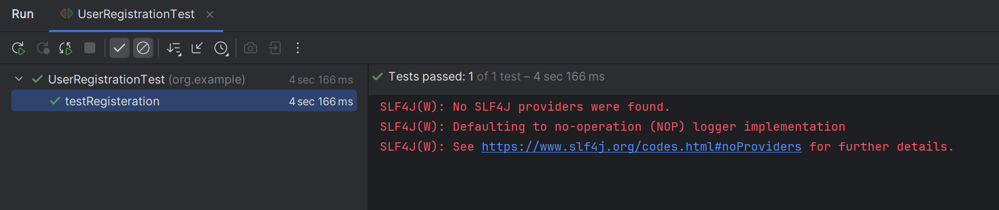

# Creational Patterns
## Task Implement a Test User Builder for User Registration Test SUT - https://formy-project.herokuapp.com/form
## Introduction
This project is dedicated to demonstrating the implementation and usage of various Creational Design Patterns in software development. Creational patterns provide various object creation mechanisms, which increase flexibility and reuse of existing code.

## Patterns Covered
- Singleton Pattern
- Factory Method
- Builder Pattern

### Dependencies Used
- Selenium-Java V4.24.0
- Bonigarcia WebDriverManager V5.8.0
- JUnit V4.13.1

### Prerequisites
- Java 8 or higher
- Maven (for dependency management and running the project)

## Screenshots
- Browser Registration Form
    
- IDE Test Case Result
    